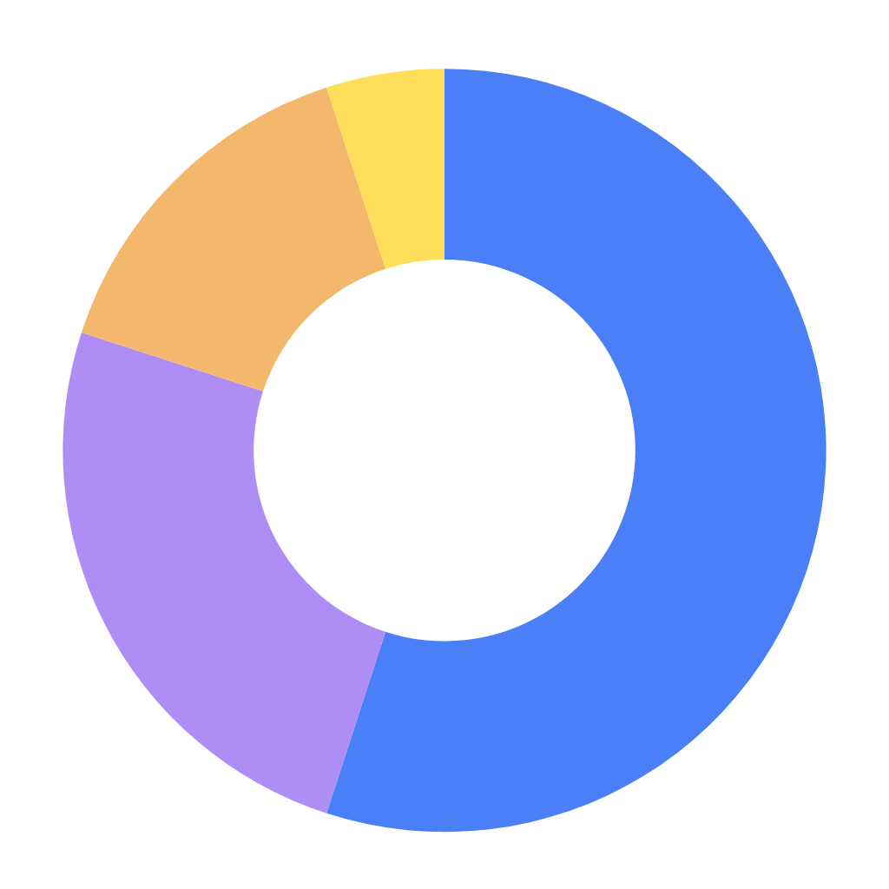

# ClearMoney 💸

[](https://www.youtube.com/watch?v=FaZXaY6Ym6Q)


> **Privacy-first personal finance powered by on-device AI.**
> Fine-tuned Gemma 4 · GGUF · llama.cpp · Unsloth · Zero cloud.

<p align="center">
  
</p>

---

## What is ClearMoney?

ClearMoney is a personal finance app for iOS that runs entirely on your device. Import your bank statements — PDF or a photo of a paper statement — and get a complete picture of your finances: spending breakdowns, budget tracking, AI-generated insights, month-over-month comparisons, and a conversational AI advisor.

**There is no server. No cloud. No account. No API call. Your data never leaves your phone.**

Built for the [Gemma 4 Good Hackathon](https://kaggle.com/competitions/gemma-4-good-hackathon).

---

## AI Stack

### Fine-tuning with Unsloth
We fine-tuned **Gemma 4** on real-world financial transaction data using [Unsloth](https://github.com/unslothai/unsloth) — cutting training time in half and reducing GPU memory by 60% vs standard fine-tuning. The model learns to categorise transactions, detect recurring charges, and understand merchant names across all supported banks.

→ Weights published on [Hugging Face](https://huggingface.co)

### GGUF Quantisation & llama.cpp Inference
The fine-tuned model is quantised to **GGUF format** — the compressed binary standard used by llama.cpp. The 4.7 GB file is downloaded once on first launch and runs **real-time inference on an iPhone** with zero internet.

### Cactus-Style Intelligent Routing
A two-model pipeline inspired by [Cactus](https://github.com/cactus-compute/cactus):
- `tryRuleCategorize` — blazing-fast rule engine for known merchants (zero latency)
- `batchCategorize` — Gemma 4 handles unknown or ambiguous merchants

Most transactions are categorised instantly. Gemma 4 only runs on the subset that actually needs it — maximising speed and battery life.

### Statement Parsing
| Input | Engine |
|-------|--------|
| Digital PDF | PDF.js (sandboxed WebView) |
| Paper photo | Tesseract.js OCR (sandboxed WebView) |

Both run entirely on-device.

---

## Features

### Dashboard
- **Financial Health Score** — live ring (0–100), calculated from SQLite, "LIVE" badge
- **Spent This Period** — animated number, month-over-month trend arrow, Income + Txn count mini-stats
- **Spending Card** — remaining budget, daily rate pill ($/day for N days), progress bar (blue → amber → red)
- **Quick Actions** — Search, Transactions, Subscriptions, Budgets, Calendar, Ask AI
- **Bill Predictor** — forecasts upcoming recurring charges
- **Spending Trend** — 6-month bar chart
- **Category Breakdown** — segmented colour bar + Donut chart
- **Budgets** — live progress bars for each category
- **Overview Table** — Total Income, Total Spent, Net, Transaction count
- Filter by **bank** and **month** — all computed from local SQLite

### Insights
- **Snapshot strip** — Savings Rate, Daily Average, Subscription total (3 stat cards)
- **Smart Alerts** — auto-fires for spending spikes, low savings rate, subscription bloat, weekend anomalies
- **Monthly Trend** — 6-month bar chart with month-over-month percentage badge
- **Spending Breakdown** — per-category percentage bars, ranked by amount
- **Habits & Patterns** — weekday avg, weekend avg, busiest day of week, biggest single transaction
- **Recurring Charges** — auto-detected subscription list
- **Income vs Spending** — net savings bar, green/red result
- **Month picker** — tap any month chip to recompute everything instantly

### AI Chat
- Conversational interface with your custom-named AI advisor
- Powered by fine-tuned Gemma 4 via GGUF inference
- Starter question chips + contextual follow-up suggestions after every answer
- Dollar amounts highlighted inline in responses
- Streaming token-by-token output with animated cursor
- **100% on-device** — the AI sees your data because it IS your data

### Compare Mode
Side-by-side comparison of any two months. Per-category delta badges — green where spending improved, red where it increased.

### Budgets
- Create budgets per spending category
- Haptic warning at 90% threshold (Heavy impact via expo-haptics)
- Budget rollover support

### Other Screens
- **Transactions** — searchable, filterable full history with per-row haptic feedback
- **Subscriptions** — auto-detected recurring charges list
- **Calendar** — transaction calendar view
- **Search** — full-text search across all transactions

### Privacy & Security
- **Face ID / Touch ID** lock via `expo-local-authentication`, re-locks after 60s in background
- **All data in expo-sqlite** on-device — no sync, no backup to cloud
- **No account, no login, no tracking, no analytics**
- Profile page: *"All data stays on your device. Zero cloud. Zero tracking."*
- Factory Reset permanently deletes all data + model file

### UX Polish
- Dark / light theme toggle
- `expo-haptics` throughout: taps, budget creation, warnings, upload success
- Skeleton loading screens (animated opacity pulse matching content layout)
- Pull-to-refresh on Dashboard and Insights
- Offline indicator badge ("on device") in headers

---

## Tech Stack

| Layer | Technology |
|-------|-----------|
| Framework | React Native · Expo SDK 54 · Expo Router v3 |
| Architecture | New Architecture (RCTNewArchEnabled: true) |
| AI Model | Gemma 4 (fine-tuned) |
| Fine-tuning | Unsloth |
| Model format | GGUF (4.7 GB, 4-bit quantised) |
| Inference | llama.cpp-compatible on-device runtime |
| Model hosting | Hugging Face |
| Routing | Cactus-inspired dual-model pipeline |
| PDF parsing | PDF.js (WebView sandbox) |
| OCR | Tesseract.js (WebView sandbox) |
| Database | expo-sqlite |
| Biometrics | expo-local-authentication |
| Haptics | expo-haptics |
| Typography | DM Sans + DM Serif Display |
| Charts | react-native-svg (custom DonutChart, SpendingBarChart) |

### Supported Banks
- Chase
- Bank of America
- Wells Fargo
- Citi

---

## Project Structure

```
ClearMoney/
├── app/
│   ├── (tabs)/
│   │   ├── dashboard.tsx       # Main dashboard
│   │   ├── insights.tsx        # Analytics & insights
│   │   ├── chat.tsx            # AI chat interface
│   │   ├── profile.tsx         # Settings & profile
│   │   └── _layout.tsx         # Tab bar layout
│   ├── upload.tsx              # Statement import & processing
│   ├── compare.tsx             # Month comparison
│   ├── budgets.tsx             # Budget management
│   ├── transactions.tsx        # Transaction list
│   ├── subscriptions.tsx       # Recurring charges
│   ├── calendar.tsx            # Calendar view
│   ├── search.tsx              # Full-text search
│   ├── onboarding.tsx          # First-run setup
│   └── index.tsx               # Entry / model download
├── src/
│   ├── components/
│   │   ├── HealthScoreRing.tsx  # Financial health ring
│   │   ├── DonutChart.tsx       # Category donut
│   │   ├── SpendingBarChart.tsx # Monthly trend bars
│   │   ├── BillPredictor.tsx    # Upcoming bills
│   │   ├── AnimatedNumber.tsx   # Counting number animation
│   │   ├── BiometricLock.tsx    # Face ID / Touch ID gate
│   │   ├── Skeleton.tsx         # Loading skeletons
│   │   ├── ProcessingView.tsx   # Upload pipeline UI
│   │   ├── ThemeContext.tsx      # Dark/light theme
│   │   ├── InsightCard.tsx      # AI insight cards
│   │   ├── OfflineIndicator.tsx # "on device" badge
│   │   └── Typography.ts        # Font tokens
│   ├── gemma/
│   │   ├── client.ts            # llama.cpp inference client
│   │   ├── batchCategorizer.ts  # Gemma 4 batch categorisation
│   │   ├── rules.ts             # Rule-based fast categoriser
│   │   ├── downloadManager.ts   # Model download & progress
│   │   ├── prompts.ts           # Prompt templates
│   │   ├── transferDetector.ts  # Transfer vs expense detection
│   │   └── agents/
│   │       ├── chat.ts          # Conversational AI agent
│   │       ├── categorizer.ts   # Transaction categoriser agent
│   │       ├── predictor.ts     # Cash flow predictor agent
│   │       └── behavior.ts      # AI personality & behaviour
│   ├── parsers/
│   │   ├── chase.ts             # Chase PDF parser
│   │   ├── bofa.ts              # Bank of America parser
│   │   ├── wellsfargo.ts        # Wells Fargo parser
│   │   ├── citi.ts              # Citi parser
│   │   ├── pdfExtractor.tsx     # PDF.js WebView extractor
│   │   ├── imageOCR.tsx         # Tesseract.js WebView OCR
│   │   ├── shared.ts            # Shared parsing utilities
│   │   └── index.ts             # Parser router
│   ├── db/
│   │   ├── schema.ts            # SQLite schema & migrations
│   │   └── transactions.ts      # All DB queries
│   └── types/
│       └── index.ts             # TypeScript types
```

---

## Getting Started

### Prerequisites
- Node.js 18+
- Expo CLI
- Xcode (for iOS simulator or device)
- An iOS device or simulator

### Install

```bash
git clone https://github.com/sanjay347/Gemma-4-hackathon.git
cd Gemma-4-hackathon
npm install
```

### Run

```bash
npx expo run:ios
```

On first launch the app will download the fine-tuned Gemma 4 GGUF model (~4.7 GB). This is a one-time download. After that the app works fully offline.

### Import a Statement

1. Tap **+** to go to the Upload screen
2. Select your bank
3. Choose a PDF or take a photo of a paper statement
4. Watch the on-device pipeline categorise every transaction

---

## Privacy Guarantee

| What we collect | Amount |
|----------------|--------|
| Data sent to servers | **Zero** |
| Analytics or tracking | **None** |
| Account required | **No** |
| Internet after setup | **Not needed** |

All transaction data lives in a local SQLite database on your device. The AI model runs inference locally. The app functions completely in airplane mode.

---

## Hackathon Tracks

This project is submitted to the following tracks:

| Track | Relevance |
|-------|-----------|
| **Main Track** | Full-stack on-device AI finance app |
| **Digital Equity & Inclusivity** | Free, no account, no subscription, works for anyone |
| **Safety & Trust** | Zero data collection, explainable categorisation, on-device only |
| **Global Resilience** | Fully offline-first, works in low-connectivity regions |
| **Cactus Special Tech** | Dual-model intelligent routing pipeline |
| **Unsloth Special Tech** | Fine-tuned Gemma 4 on financial transactions with Unsloth |
| **llama.cpp Special Tech** | 4-bit GGUF model running on mobile hardware |

---

## License

MIT — free to use, modify, and build on.

---

<p align="center">
  <strong>ClearMoney v1.0.0 · Built for privacy · Powered by on-device AI</strong>
</p>
